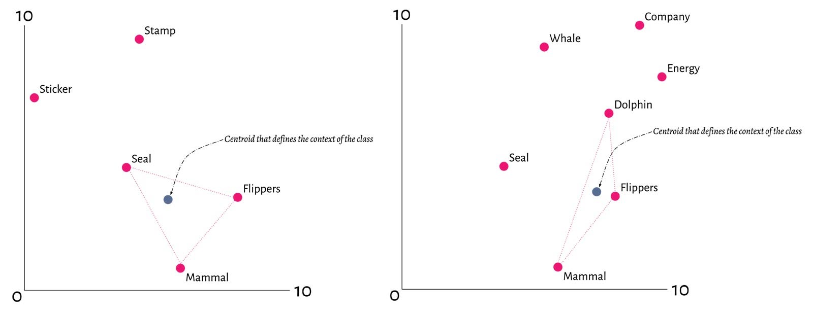
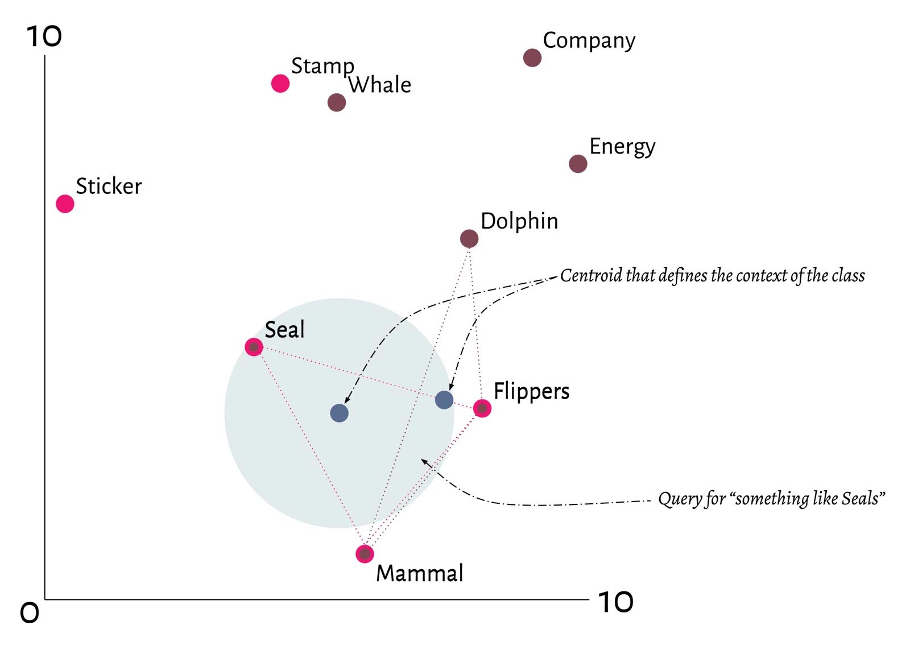

# Contextionary

> Documentation about what Weaviates contextionary is and how it functions.

The contextionary is a stand-alone library that can be used to understand words, in a certain context, and how they relate to each other.
It is based on [Spotify's Annoy Library](https://github.com/spotify/annoy) and the models are trained using [GloVe](https://github.com/stanfordnlp/GloVe), but adds a wrapping layer to be more user friendly.

## Concept

Every Weaviate has a contextionary attached to it which contains a large vocabulary and the relations that the words have to each other expressed in a multi-dimensional space. The keywords in the ontology are used to create a centroid in the vector space that gives context to the meaning of the data stored.

An example in two dimensions:   


This brings the feature of context. In future machine to machine communication over the P2P network, a Weaviate can express what the data's meaning is when it transfers information. This also means that answers to queries are Fuzzy<sup><a href="https://en.wikipedia.org/wiki/Fuzzy_logic" alt="Fuzzy">(ref)</a></sup> in nature, a SeMI node tries to interpret the question based on the context it has.

Because all nodes on the network use the same contextionary, Weaviates can interact with each other based on the context determined by the contextionary. Instead of sharing the actual words or ontology, a Weaviate shares the context based on the positions in the vector space.

For example, if Weaviate no.I has a class: "Seal" and Weaviate no.II the class "Dolphin", they can be visualized as follows:



This means it is possible to not only limit the knowledge graph to one single Weaviate but also to create a _network of knowledge graphs_. Known as a Knowledge Network. When queried, one Weaviate can ask another Weaviate about some class or property that is similar to a class or property in the node.

For example: _Which Weaviate knows about the centroid of "Seal", "Mammal" and "Flippers"._



## Download

All Weaviate containers automatically download and install the contextionary from: c11y.semi.technology.

- All metadata regarding contextionaries can be found [here](https://c11y.semi.technology/contextionary.json).
- Versioned urls are formatted as: `https://c11y.semi.technology/%version%/%language%` (`base_url`).
- Contextionary files include: `%base_url%/contextionary.vocab`, `%base_url%/contextionary.idx`, `%base_url%/contextionary.knn`.

_Note: Contextionaries are **not** backwards compatibility_

## Example of downloading latest vocabulary

```bash
wget https://c11y.semi.technology/$(curl -sS https://c11y.semi.technology/contextionary.json | jq -r ".latestVersion")/en/contextionary.vocab
```

_Note: assumes `jq` and `curl` are installed_

## About the generation of Contextionaries

- Contextionaries are ocassionally updated.
- The `contextionary.vocab` contains the vocabulary of the contextionary.

## Available languages

Only English (`en`).

## API
The API that the user of this library will use is the Contextionary interface.

```go
type Contextionary interface {
	// Return the number of items that is stored in the index.
	GetNumberOfItems() int

	// Returns the length of the used vectors.
	GetVectorLength() int

	// Look up a word, return an index.
	// Check for presence of the index with index.IsPresent()
	WordToItemIndex(word string) (ItemIndex)

	// Based on an index, return the assosiated word.
	ItemIndexToWord(item ItemIndex) (string, error)

	// Get the vector of an item index.
	GetVectorForItemIndex(item ItemIndex) (*Vector, error)

	// Compute the distance between two items.
	GetDistance(a ItemIndex, b ItemIndex) (float32, error)

	// Get the n nearest neighbours of item, examining k trees.
	// Returns an array of indices, and of distances between item and the n-nearest neighbors.
	GetNnsByItem(item ItemIndex, n int, k int) ([]ItemIndex, []float32, error)

	// Get the n nearest neighbours of item, examining k trees.
	// Returns an array of indices, and of distances between item and the n-nearest neighbors.
	GetNnsByVector(vector Vector, n int, k int) ([]ItemIndex, []float32, error)
}
```
This interface and the core types are defined in [main.go](./main.go)

An example of how to find close neighbours to a word:

```go
  king_idx := my_vector_index.WordToIndexItem("king")

  if !king_ids.IsPresent() {
    panic("No king!")
  }

  indices, distances, err := my_vector_index.GetNNsByItem(king_idx, 10, 3)
  if err != nil {
    panic(fmt.Sprintf("Could not get Nearest Neighbours of king, because: %v", err))
  }

  for i, index := range indices {
    dist := distances[i]
    word, err := my_vector_index.ItemIndexToWord(index)
    if (err != nil) { panic("Should be available") }
    fmt.Printf("king -> %v with distance %v\n", word, dist)
  }
```

## The different vector indicies
There are several implementations of the `Contextionary` interface

- A memory mapped one
- In-memory index
- Combining index

The **Memory Mapped index**, uses an optimized pre-build datastructure that is loaded on-demand
and efficiently from disk.
This is suitable for big datasets that you don't want to load on-line, but preprocess before.

It can be instantiated via `my_vector_index, err := contextionary.LoadVectorFromDisk("index.knn", "index.idx")`.
See the documentation for (the generator)[./generator] of this file format for more details on
these files.

The **In-Memory index** can be used for smaller datasets. Because of how the underlying Spotify
Library is build, there are two separate phases, one in which we can add words, and one in which
they can be queried.

Usage example:
```go
// support vectors of 3 dimensions
builder := contextionary.InMemoryBuilder(3)
builder.AddWord("my_word1", NewVector([]float32 { 0, 1, 2,}))
//... etc ...
builder.AddWord("my_word2", NewVector([]float32 { 42, 42, 42,}))

// build three trees, and cast it to the Contextionary interface
// Now it can be queried as described in the interface section.
memory_index := Contextionary(builder.Build(3))
```


The **CombinedIndex**, which delegates to two or more other indicies, but makes sure that
the ItemIndex ranges do not overlap; it provides an abstraction over underlying Vector Indices.

Usage example:
```go
// assuming that we have two indices vi1 and vi2.
var indices_to_be_combined []Contextionary = { vi1, vi2, }
combined_index, err := contextionary.CombineVectorIndices(indices_to_be_combined)

// after which it can be queries as descrbied in the interface section.
```

## Helper Functions

There are a few helper functions available that you can call.

```golang
import libcontextionary "github.com/semi-technologies/weaviate/contextionary"
```

Overview of the API

```golang
// Calculate a centroid of vector points
ComputeCentroid(vectors []Vector) (*Vector, error)

// Calculate a centroid of vector points with a weight, used to put more emphasis on a certain word
ComputeWeightedCentroid(vectors []Vector, weights []float32) (*Vector, error)

// Combined vector indices, allows you to create one "new word"
CombineVectorIndices(indices []Contextionary) (*CombinedIndex, error)
```
