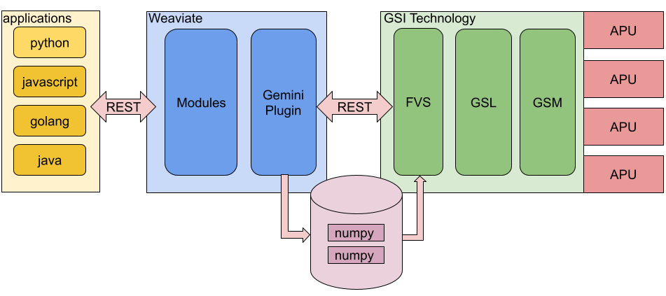

# Weaviate Gemini Plugin

The Weaviate Gemini Plugin provides an alternate approximate nearest neighbor (ANN) implementation for Weaviate that is based on hardware acceleration powered by GSI Technology's Gemini Associative Processor (APU).

The features of this plugin include:
* provides accurate and fast vector search for large-scale vector datasets 
* the plugin is implemented in pure Golang
* the plugin interfaces directly with Gemini's FVS (Fast Vector Search) REST web service API

# System Architecture

The following is a high-level architecture of a complete system with the Weaviate Gemini Plugin:

Additional component descriptions:
* *Gemini Plugin* - Serves as the bridge between Weaviate and GSI's vector search acceleration technology.  The following [README](./weaviate_gemini_plugin/README.md) discusses further how we've structured the code.
* *FVS*  -GSI's Fast Vector Search provides an easy-to-use REST web interface for GSI's accelerated search capabilities.
* *GSL*  -GSI Search Library contains efficient vector search algorithms tuned to the APU acceleration technology.
* *GSM*  -GSI System Management manages multiple APU PCIe boards
* *APU*  -GSI's custom hardware accelerator technology based on the Gemini Associative Processor chip.
* *numpy*  -The Gemini Plugin stores raw vectors as Numpy compatible files and shares the vectors with the FVS via file system memory mapping.

# Quick Start

If you just want to see something working first, then following the directions in this section.

Prerequisites:
* You should have access to a system with Gemini APU boards installed.
* The system should have GSI's Fast Vector Search (FVS) support installed.
* You should have created or received an "allocation id" for your system. 
* Without all of these you should not proceed and should reach out to your GSI Technology support contact.

Container Setup:
* If you haven't already, clone this repository on the system and cd into the top-level directory.
* Now cd into the [gsi](../gsi) directory
* Run the docker build script [rundockerbuild.sh](./rundockerbuild.sh) which builds a Gemini Plugin-enabled container locally called "gsi/weaviate"
* Now cd into the [gsi/docker/t2v](docker/t2v) directory
* Run the docker build script [rundockerbuild.sh](docker/t2v/rundockerbuild.sh) which builds a vectorization container locally called "gsi/t2v"
* Now cd into the [gsi/docker](./docker) directory
* Edit the file [docker-compose-sanity.yml](./docker/docker-compose-sanity.yml) and set the env var GEMINI_ALLOCATION_ID to your allocation id and run the file via docker-compose.
* Wait until you see the "started" message which indicates that the Weaviate server has successfully start.

Python Example:
* In another terminal, cd into the [gsi/tests](./tests) directory
* Create a new python=3.8 environment, activate it, and install the python packages via the [requirements.txt](./tests/requirements.txt) file
* Run the following python file [weaviate-gemini-sanity.py](./tests/weaviate-gemini-sanity.py)
* This Weaviate python program will create a Gemini index, import some data into it, and will finally perform some example searches against the index.

# Gemini Plugin Configuration

The Gemini plugin requires minimal configuration at the server and the application client. 

## Weaviate Server Configuration

This codebase contains all the Gemini Plugin code, so build and deploy the container as you would normally (see the script at [gsi/rundockerbuild.sh](./rundockerbuild.sh) )

The following environmental variables are unique to Gemini Plugin configuration at the server:
* *GEMINI_ALLOCATION_ID*  -This must be set to a valid allocation id.  Please consult your onboarding instructions or reach out to your GSI support contact for more information.
* *GEMINI_DATA_DIRECTORY* -This directory must exist and live under "/home/public."  This location is currently an FVS requirement.  This directory itself is critical for data transfer between Gemini Plugin and the FVS.
* *GEMINI_FVS_SERVER* -This is the server address of your FVS server.  Typically, its value should be 'localhost' since the FVS server would typically be co-located with your Weaviate server instance.
* *GEMINI_DEBUG* -By default its false.  Set to 'true' (lower-case) to see more Gemini Plugin log messages printed to the console.  This is useful when debugging Gemini Plugin configuration issues.

See the docker-compose file at [gsi/docker/docker-compose-sanity.yml](./docker/docker-compose-sanity.yml) for an example of how to set these environmental variables.

## Weaviate Client Configuration

The default vector index is Weaviate's native implementation of HNSW.  To override this in your application, you must set the *vectorIndexType* property to *gemini* when you create your Weaviate class schema.

There is a python example located at [gsi/tests/weaviate-gemini-sanity.py](./tests/weaviate-gemini-sanity.py) that demonstrates this.

# Comparing Gemini Plugin To Weaviate's Native HNSW

## Search Performance

Since Weaviate can now support both the Gemini Plugin alongside its native HNSW, it's now straightforward to perform an apples-to-apples comparison of both ANN algorithms on the same system and the same data.  We will be performing these measurements on various large scale datasets and reporting the results here at a later time.

We can show at this time benchmarks on FVS, upon which the Gemini Plugin is built.  Please see this [README](fvs/README.md) for those detailed results.  In that directory, you will find code and instructions so that you can reproduce these results on your system.

## Off-line Index Training

The algorithm that powers the Gemini Plugin (via the FVS) requires an off-line index training/build step.  This contrasts to the native HNSW algorithm which builds its index incrementally and dynamically as the Weaviate application adds vectors. The Gemini Plugin launches the index training operation in a deferred manner, when the Weaviate application invokes its first "search" query.  The index training runs asynchronously (e.g, in the background), and therefore does not block the Weaviate client application.  The application immediately receives a message indicating asynchronous training operation started.  Weaviate developers should take note of this as they may need to modify their application's control flow accordingly when using a Gemini index.

Ideally, a Weaviate client application that leverages the Gemini Plugin should be structured as follows:
* first add all the objects that need to be vectorized via the relevant Weaviate import API calls.
* then it should perform a Weaviate search API call and look for a response message indicating "asynchronous index training is in progress."
* it should then continue querying Weaviate until the response message indicates that the "asynchronous index training is complete."
* subsequent search calls will complete with the expected search results

We have supplied an example python program which demonstrates this application flow, located at [gsi/tests/weaviate-gemini-sanity.py](./tests/weaviate-gemini-sanity.py).

As datasets become larger, the elapsed time that your application needs to wait for the index training to complete will increase as well.  Please see the [Gemini offline training benchmarks](./fvs/README.md) for more information.

#  Roadmap

More Gemini Plugin improvements are coming as we continue to integrate deeper into Weaviate and, importantly, as the Weaviate ecosystem starts to give us feedback:

* we are working on eliminating the off-line training process of the Gemini index
* integrate system observability metrics into Prometheus alongside Weaviate
* support Weaviate's fail-over and replication strategies for data center high-availablity deployment
* implement Weaviate's native HNSW data recovery such as index re-initialization
* integrate test automation including unit tests, stress tests, and code coverage tests by extending Github's CI/CD infrastructure to GSI's hardware cloud
* continued benchmark efforts comparing the hardware accelerated Weaviate Gemini index vs. native HNSW for large datasets
