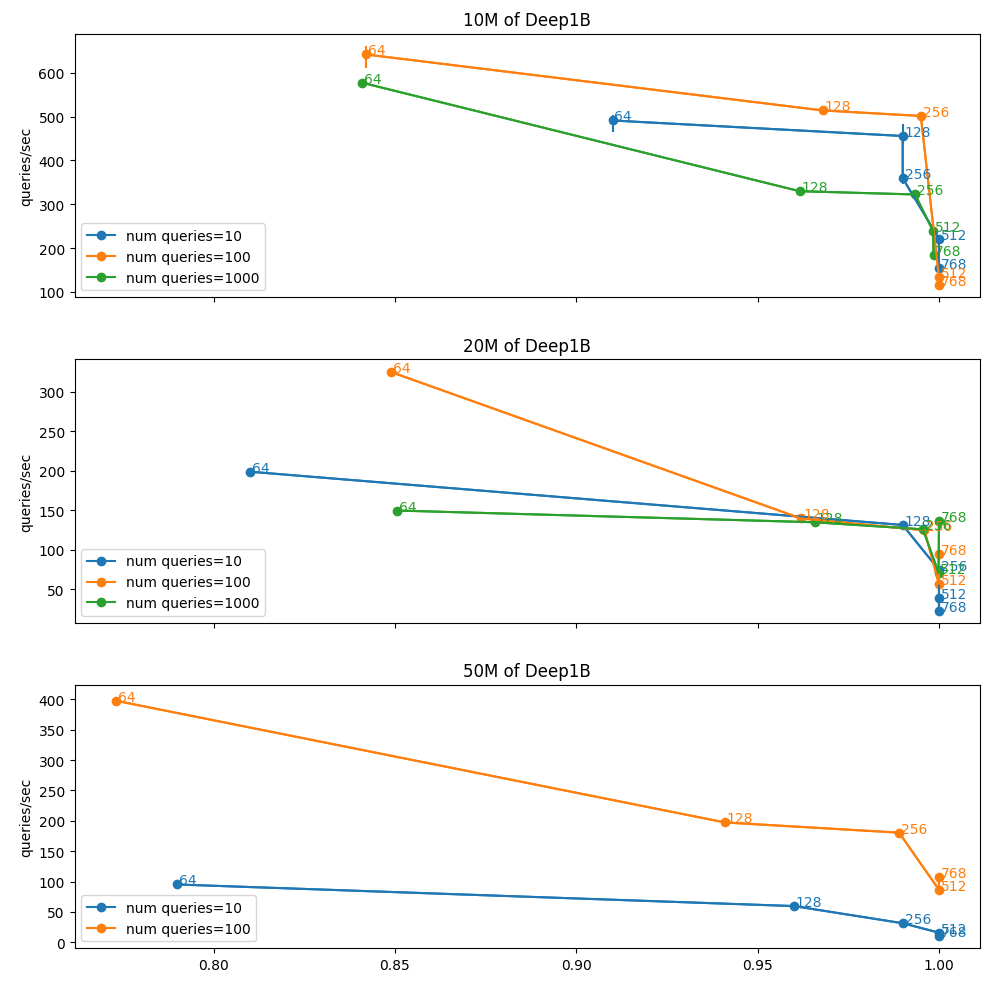
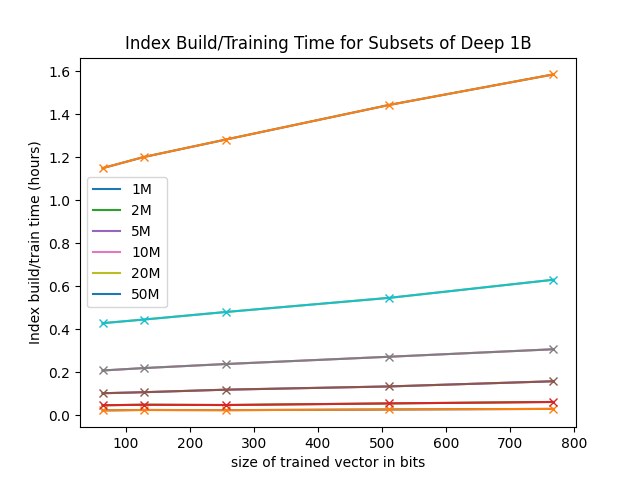
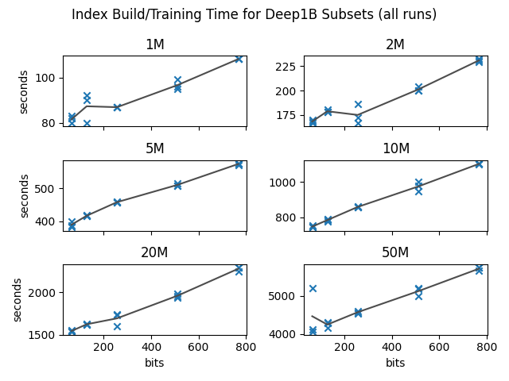

# GSI Technology's Gemini Fast Vector Search (FVS)

The Weaviate Gemini Plugin leverages GSI Technologies FVS Software Library.

This directory provides benchmarks for FVS as well as instructions for how you can reproduce these benchmarks on your system.

# Deep1B Benchmarks

## Search Recall vs Throughput

Note: The following datasets are not shown yet:
* 100M of Deep1B
* 250M of Deep1B
* 500M of Deep1B
* All of Deep1B

## Index Build/Training Time

Note: The following datasets are not shown yet:
* 100M of Deep1B
* 250M of Deep1B
* 500M of Deep1B
* All of Deep1B

## Reproducing These Benchmarks

To reproduce the benchmarks shown above, do the following:
* login to a system with Gemini FVS installed
* create the data using the "make_datasets.py" file in this directory
* create or locate an FVS "allocation" and copy its id for use later
* configure the top of these scripts and run them:
  * [run_benchmarks_deep1M_q10.sh](run_benchmarks_deep1M_q10.sh)
  * [run_benchmarks_deep1M_q100.sh](run_benchmarks_deep1M_q100.sh)
  * [run_benchmarks_deep1M_q1000.sh](run_benchmarks_deep1M_q1000.sh)
  * [run_benchmarks_deep2M_q10.sh](run_benchmarks_deep2M_q10.sh)
  * [run_benchmarks_deep2M_q100.sh](run_benchmarks_deep2M_q100.sh)
  * [run_benchmarks_deep2M_q1000.sh](run_benchmarks_deep2M_q1000.sh)
  * [run_benchmarks_deep5M_q10.sh](run_benchmarks_deep5M_q10.sh)
  * [run_benchmarks_deep5M_q100.sh](run_benchmarks_deep5M_q100.sh)
  * [run_benchmarks_deep5M_q1000.sh](run_benchmarks_deep5M_q1000.sh)
  * [run_benchmarks_deep10M_q10.sh](run_benchmarks_deep10M_q10.sh)
  * [run_benchmarks_deep10M_q100.sh](run_benchmarks_deep10M_q100.sh)
  * [run_benchmarks_deep10M_q1000.sh](run_benchmarks_deep10M_q1000.sh)
  * [run_benchmarks_deep20M_q10.sh](run_benchmarks_deep20M_q10.sh)
  * [run_benchmarks_deep20M_q100.sh](run_benchmarks_deep20M_q100.sh)
  * [run_benchmarks_deep20M_q1000.sh](run_benchmarks_deep20M_q1000.sh)
  * [run_benchmarks_deep50M_q10.sh](run_benchmarks_deep50M_q10.sh)
  * [run_benchmarks_deep50M_q100.sh](run_benchmarks_deep50M_q100.sh)
* to plot your data, use the following notebooks:
  * [recall vs throughput notebook](benchmarks_analysis.ipynb)
  * [training time notebook](training_time_analysis.ipynb)
* we tested with python 3.8 so recommend you use that version

## Benchmarks On A Transformer-based 768-dimension Dataset

This is not yet done.

