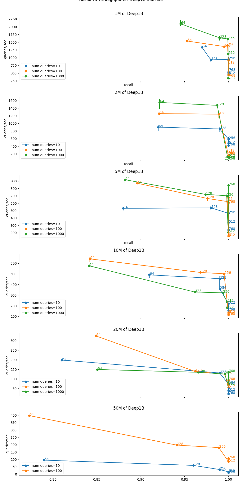
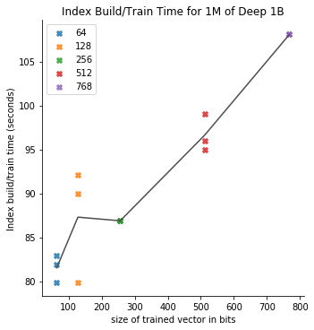
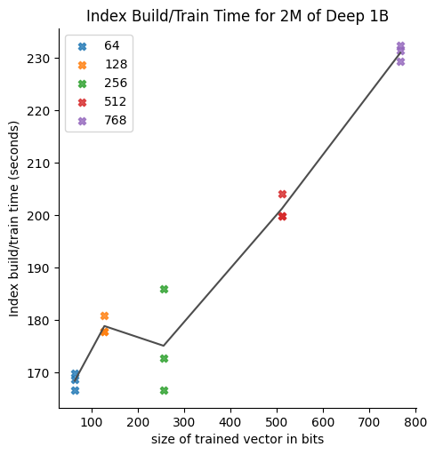
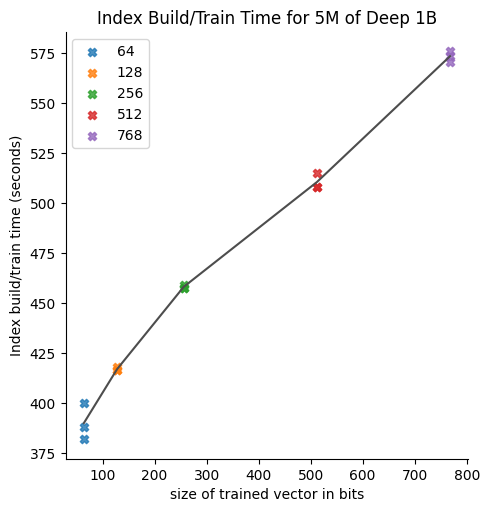
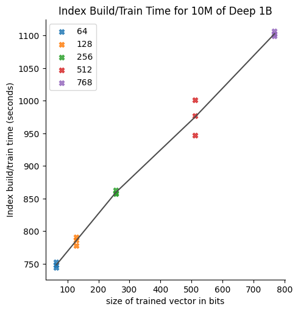
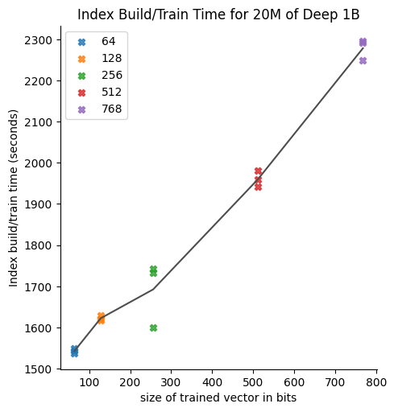
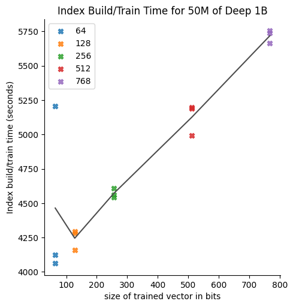

# GSI Technology's Gemini Fast Vector Search (FVS)

## Introduction

The Weaviate Gemini Plugin leverages GSI Technologies FVS Software Library.

This directory provides profiling, debugging, and benchmark utilities and scripts for FVS.

## Benchmarks

### Deep1B

To reproduce the benchmarks shown above, do the following:
* login to a system with Gemini FVS installed
* create or locate an FVS "allocation" and copy its id for use later
* configure the top of these scripts and run them:
  * [run_benchmarks_deep1M_q10.sh](run_benchmarks_deep1M_q10.sh)
  * [run_benchmarks_deep1M_q100.sh](run_benchmarks_deep1M_q100.sh)
  * [run_benchmarks_deep1M_q1000.sh](run_benchmarks_deep1M_q1000.sh)
  * [run_benchmarks_deep2M_q10.sh](run_benchmarks_deep2M_q10.sh)
  * [run_benchmarks_deep2M_q100.sh](run_benchmarks_deep2M_q100.sh)
  * [run_benchmarks_deep2M_q1000.sh](run_benchmarks_deep2M_q1000.sh)
  * [run_benchmarks_deep5M_q10.sh](run_benchmarks_deep5M_q10.sh)
  * [run_benchmarks_deep5M_q100.sh](run_benchmarks_deep5M_q100.sh)
  * [run_benchmarks_deep5M_q1000.sh](run_benchmarks_deep5M_q1000.sh)
  * [run_benchmarks_deep10M_q10.sh](run_benchmarks_deep10M_q10.sh)
  * [run_benchmarks_deep10M_q100.sh](run_benchmarks_deep10M_q100.sh)
  * [run_benchmarks_deep10M_q1000.sh](run_benchmarks_deep10M_q1000.sh)
  * [run_benchmarks_deep20M_q10.sh](run_benchmarks_deep20M_q10.sh)
  * [run_benchmarks_deep20M_q100.sh](run_benchmarks_deep20M_q100.sh)
  * [run_benchmarks_deep20M_q1000.sh](run_benchmarks_deep20M_q1000.sh)
  * [run_benchmarks_deep50M_q10.sh](run_benchmarks_deep50M_q10.sh)
  * [run_benchmarks_deep50M_q100.sh](run_benchmarks_deep50M_q100.sh)
* to plot your data, use the following [notebook](benchmarks_analysis.ipynb)

Notes:
* we tested with python 3.8 so recommend you use that version
* make sure no other intensive workloads are running when you benchmark (leverage 'who' and 'htop' to get this information )

## Index Build/Train Time

To reproduce the training time plots shown below, do the following:
* to plot your data, use the following [notebook](training_time_analysis.ipynb)

## Datasets

To create the various benchmark datasets used in these benchmarks, edit and run the 'make_datasets.py' python script in this directory.

