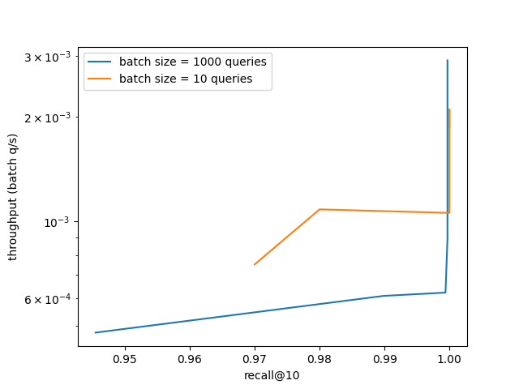

# GSI Technology's Gemini Fast Vector Search (FVS)

## Introduction

The Weaviate Gemini Plugin leverages GSI Technologies FVS Software Library.

This directory provides profiling, debugging, and benchmark utilities and scripts for FVS.

## Benchmarks

### 1M of Deep1B

To reproduce the benchmarks shown above, do the following:
* login to a system with Gemini FVS installed
* create or locate an FVS "allocation" and copy its id for use later
* configure the top of these scripts and run them:
  * [run_benchmarks_deep1M_q10.sh](run_benchmarks_deep1M_q10.sh)
  * [run_benchmarks_deep1M_q1000.sh](run_benchmarks_deep1M_q1000.sh)
* to plot your data, use the following [notebook](benchmarks_analysis.ipynb)
